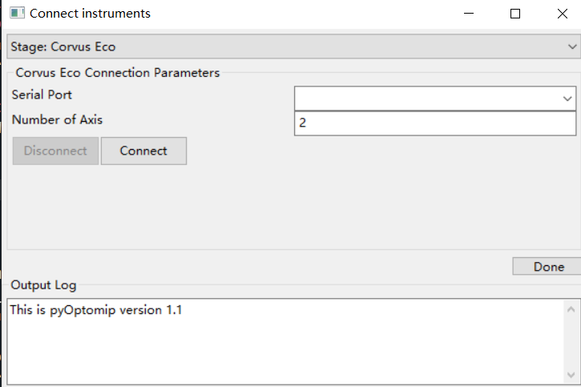
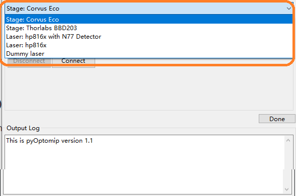
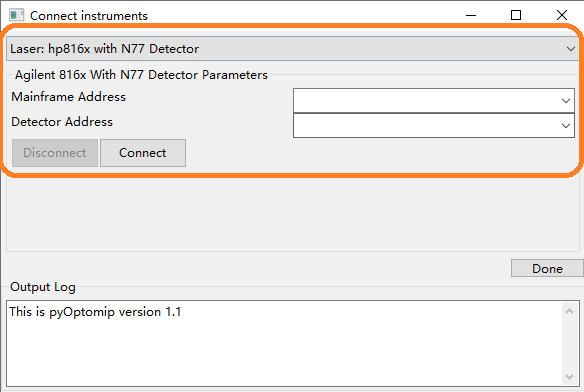
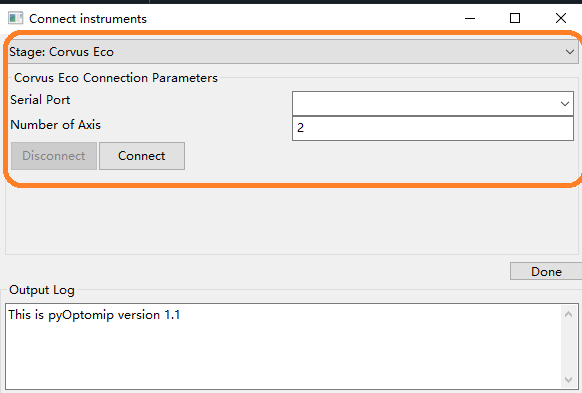
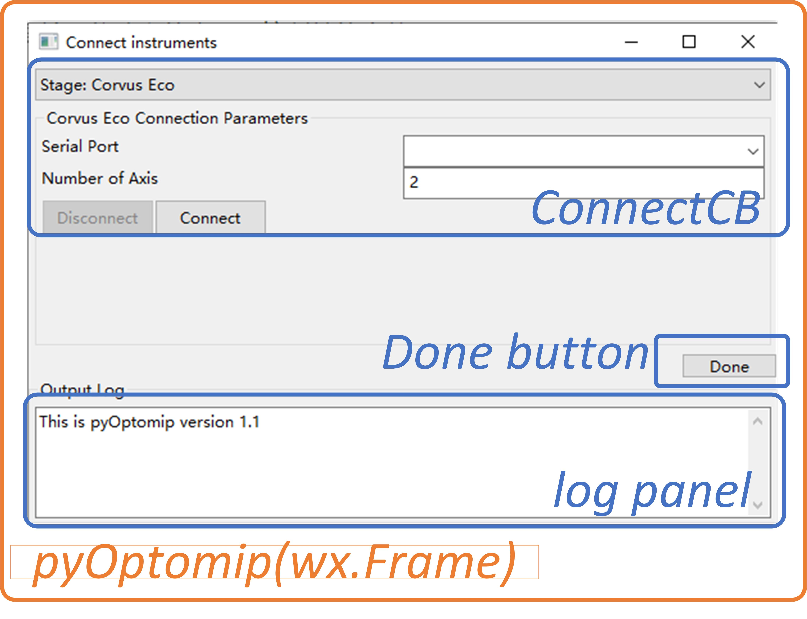
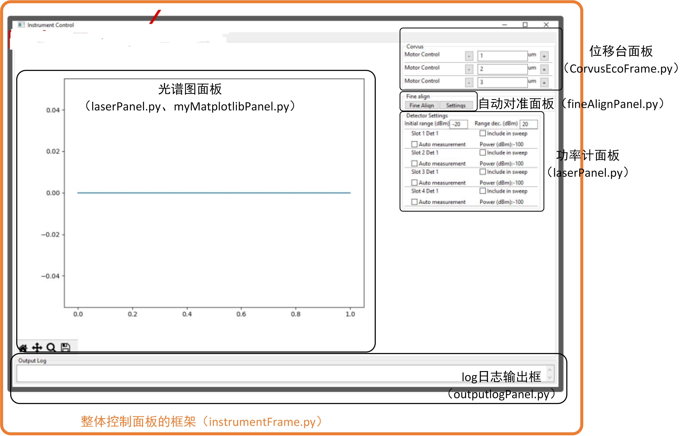
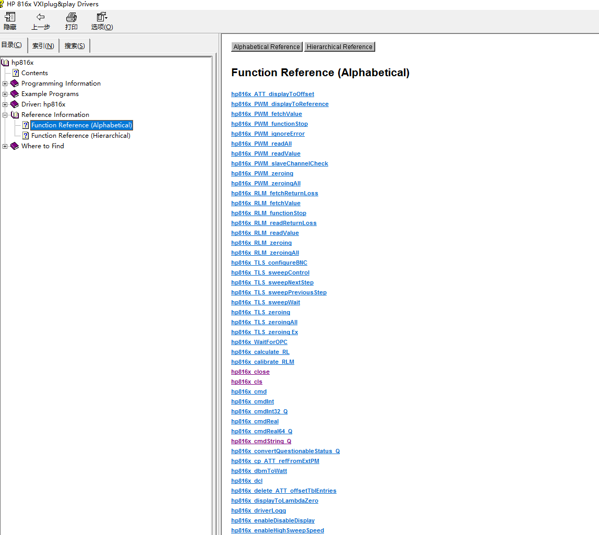

# SiEPIClab（原名pyOptomip） 代码学习笔记

[TOC]

该文档记录了我学习SiEPIClab的笔记。我将代码文件，按照功能，分为几个部分:

- 软件GUI相关代码
- 仪器对象代码；包含所控制仪器的函数库
- 功能型代码；包括自动耦合对准（Fine Align）和自动测试（Auto Measurement）

## GUI相关代码

SiEPIClab软件的GUI，主要包括1)启动时的仪器连接面板和2)进入软件后的测量控制面板。以下代码文件，定义了SiEPIClab软件的面板。

- 启动时的仪器连接面板
  - pyOptomip.pyw
  - 具有xxxxParameter.py 命名规则的代码

- 测量控制面板
  - 整体控制面板的框架：instrumentFrame.py；**该框架，嵌入了下列的各个面板，进而组成整体控制面板**，包括：
  - 各个仪器的控制面板：
    - CorvusEcoFrame.py
    - laserPanel.py
    - MGMotorPanel.py
  - 自动对准
    - fineAlignPanel.py（控制面板）
    - fineAlignSettings.py（设置对话框）
    - fineAlignDialog.py（自动对准过程中，所显示的对话框）
  - 自动测试：
    - autoMeasurePanel.py（控制面板）
    - autoMeasureProgressDialog.py（自动测试过程中所显示的对话框，用于显示测试进度）
  - log日志输出框：outputlogPanel.py
  - 扫描光谱结果显示面板：myMatplotlibPanel.py

### 仪器连接面板的相关代码文件

#### pyOptomip.pyw

该代码启动软件的仪器连接面板，如下图所示。用户需通过该初始连接面板，输入所有所需的仪器的连接参数。每输完一个仪器的参数后，点击Connect 按钮，实现与该仪器的连接。当所需的仪器全部连接完毕后，点击Done，之后便可进入测试面板。

该代码中，可选择的仪器包括（见Choice Book的下拉选项）：

1. Stage: Corvus Eco（Corvus Eco品牌电动位移台）
2. Stage: Thorlabs BBD203 （Thorlabs BBD203型号位移台）
3. hp816x_instrParameters.py（hp816x主机+嵌入主机插槽式的光功率计，我们实验室没有该种功率计）
4. hp816x_N77Det_instrParameters.py （hp816x主机+外部的N77xx型号系列功率计，符合我们实验室的配置）

该代码当时编写时，支持了UBC当时所拥有的几种仪器。

- 如，若使用Corvus Eco位移台 + HP8163B主机+N7745A功率计进行测试，那么需要依次连接“Corvus Eco”和“hp816x with N77 detector” 两个仪器选项。

- 如，若使用Thorlabs BBD203 位移台 +  HP8163B主机+N7745A功率计进行测试，那么需要依次连接“Stage: Thorlabs BBD203”和“hp816x with N77 detector” 两个仪器选项。

##### ConnectCB (wx.Choicebook):

定义一个包含多个设备连接参数面板的Choice Book，如下图所示。该类为wx.Choicebook的子类，

ConnectCB 所包含的仪器参数连接面板，被定义在本代码中的devTypes变量中（line 39-41）。devTypes 是一个 list，每个元素为wx.panel 的子类，其为每个仪器的连接参数面板。每个仪器的连接参数面板，由代码名称 xxParameter.py 所创建

- 如，对于hp816x配合N77xx系列功率计的连接参数面板 ，如下图所示。可以看到，连接该设备，我们需要输入hp816x Mainframe （主机）和N77xx 功率计的VISA地址。该面板，由 hp816x_instrParameters.py 所定义。

- 如，对于电动位移台（这里是Corvus Eco的位移台）的连接参数面板 ），如下图所示。可以看到，连接该设备，我们需要输入位移台的串口和控制轴的个数。该面板，由 CorvusEcoParameters.py 所定义。

##### class pyOptomip(wx.Frame):

定义一个整体初始面板的类。在其上面，可放置上述的Choice Book，Done按钮，和最下方的Output Log。该类为wx.Frame的子类。

最后，整体初始GUI的构成，如下图所示。

##### 其它

- self.panel中的 instList 变量: Line14：``self.panel.instList = []``：初始化了self.panel中的 instList 变量为一个空的list。instList 变量将存放已连接的仪器对象。每次成功连接一个仪器对象，该仪器对象将会被添加到 instList 变量中（通过`append`函数）。具体的，每次连接一个仪器对象时，将会调用该仪器的xxxxParameter.py 代码中的`Connect ()`函数，该函数将通过`append`函数，将该仪器对象添加到 instList 变量中。如 CorvusEcoParameters.py中的Line75: `self.connectPanel.instList.append(self.stage)`

#### xxxxParameter.py 代码文件

SiEPIClab 包括几个以Parameters结尾的代码文件，包括 ：

1. CorvusEcoParameters.py（Corvus Eco品牌电动位移台）
2. MGMotorParameters.py（Thorlabs BBD203 位移台）
3. hp816x_instrParameters.py（hp816x主机）
4. hp816x_N77Det_instrParameters.py （hp816x主机配合N77xx型号系列功率计）

这些代码文件，每个都定义了一个wx.panel的子类，用来显示特定仪器的连接参数输入的输入面板，并最终合并入pyOptomip.pyw中的ConnectCB 类的Choice Book中。详见上一章节。

### 测量控制面板的相关代码文件

#### instrumentFrame.py

该代码定义了整体控制面板的框架的类。该框架，嵌入了下列多个面板，最终组成整体的测量控制面板

- 各个仪器的控制面板：
  - CorvusEcoFrame.py
  - laserPanel.py（包含了激光器、功率计、光谱图面板）
  - MGMotorPanel.py
- 自动耦合的控制面板：fineAlignPanel.py
- 自动测试的控制面板：autoMeasurePanel.py
- log日志输出框：outputlogPanel.py
- 扫描光谱结果显示面板：myMatplotlibPanel.py

测量控制面板类似于下图所示（**下图是另外正在开发的软件版本的控制面板，与目前版本相比，有不同之处：每个面板摆放位置不同，且缺少了自动测试的控制面板。**但是我没有找到目前版本的控制面板截图，因此只能在这里放一张类似的图，以作大致说明）

## 仪器对象代码 （InstruName.py ）

SiEPIClab 包含以仪器名命名（类似InstruName.py）的代码文件，包括：

- CorvusEco.py（Corvus Eco品牌电动位移台）
- MGMotor_inst.py（Thorlabs BBD203型号位移台）
- hp816x_instr.py（hp816x主机）
- hp816x_N77Det_instr.py（hp816x主机配合N77xx型号系列功率计）

**这些代码，用来容纳仪器的函数库。如果用面向对象的角度去理解，那么这些代码都定义了一个类，这个类代表着该“仪器”，其包含了该仪器所附属的“功能”**。

下面逐一给出这些代码的学习笔记。

### hp816x_instr.py

该代码定义了激光器主机（8163B或8164B）的类: ``class hp816x(object):``

该代码使用了 Keysight的Driver提供的函数库，名为 VXIplug&play Instrument Driver ，去方便地实现高级的功能（如波长扫描）。而不是基本的SCPI命令。

该代码目的有两个：

- 若使用hp816x主机 + 嵌入主机的光功率计时，可使用该代码所定义的类，作为仪器对象（这不属于我们的情况，因为我们没有使用嵌入主机的光功率计）。
- 可作为 hp816x_N77Det_instr.py 代码中所定义的类的父类。 hp816x_N77Det_instr.py代码所定义的仪器对象，为使用hp816x主机 + N7745外部光功率计，这属于我们的情况。

因为本代码作为 hp816x_N77Det_instr.py 代码中所定义的类的父类。因此，尽管我们不直接使用本代码，但学习它仍然是有必要的。

#### 通信接口：VXIplug & play Instrument Driver 

如上所述，该代码使用了 Keysight 的 VXIplug & play Instrument Driver（以下简称 Keysight Driver）提供的函数库实现与hp816x通信。

Keysight Driver是基于Virtual Instrument Software Architecture（VISA）标准，使用VISA提供的服务。可以把它理解为针对hp816x，对VISA实现的一些封装，所实现的新的架构。hp816x编程手册种对其解释原文如下（p263）：

> The Keysight 816x VXIplug&play Instrument Driver is built on top of VISA, and uses the services provided.

Keysight Driver函数库中函数的名字，大都是以hp816x_开头。每个函数都集成了很多基本的VISA通信命令和SCPI仪器控制命令，进而方便用户去实现更复杂的功能，如波长扫描，扫描结果获取等。原文对Keysight Driver 提供的函数的解释如下：

> These functions combine multiple SCPI commands into a single,  functional operation. They are designed to allow quick and easy access to common* *instrument command sequences.*“。

Driver可通过，https://www.keysight.com/us/en/lib/software-detail/driver/816x-vxi-plugplay-driver-112417.html，下载。下载后，可通过其帮助文件，位于（我使用了默认安装路径） "C:\Program Files (x86)\IVI Foundation\VISA\Winnt\hp816x\Hp816x.chm"，来查询所有函数的用法和相关信息，见下图：

本代码常可以看到函数的参数包含指针类型，如名称以Ptr结尾的变量，和 byref（object）。此种情况，通常该函数的输出值，将赋到该变量上。换句话说，该变量，将作为函数的输出值。通俗的理解：若函数以某变量的指针为参数，则该函数希望将函数的输出值，存到该指针所指的内存地址，即赋到该变量上。

##### 通过Ctypes在Python环境调用Driver提供的函数库

Driver所提供的函数库，编写语言是基于C，或C++。因此，本代码使用python 中的[ctypes](https://docs.python.org/3/library/ctypes.html)模块，进而可以在python语言中，跨平台调用这些函数。具体的，其通过：self.hLib =      WinDLL('hp816x_32.dll');      载入Driver提供的外部函数库。另外，还有一些数据转换，目的为了实现两种语言的兼容性，如 c_int32(), byref() 函数等。hp816x_instr.py结尾的函数：``def createPrototypes(self):``，      其目的在于将Driver中的函数名，映射到python中，从而方便使用。

#### def sweep (self):

该函数实现波长扫描。由于存在单次扫描波长点数的一个最大限制值（Line 47: ``maxPWMPoints = 20001;``）。因此若实际所需的扫描波长点数超过该值（如扫描波长很宽，且扫描步长很小），该函数将所需扫描的波长分成多段，进行多次扫描，最终将每段的扫描结果，拼在（即，stitch）一起。

### hp816x_N77Det_instr.py

如上所述，本代码所定义的仪器对象，为 hp816x主机 + N77xx外部光功率计，这恰好是我们实验室的配置。

本代码所定义的类（hp816x_N77Det），为hp816x_instr.py中定义的类（hp816x）的子类。

hp816x_N77Det 类继承了大部分hp816x的函数，同时增加了一些N77xx功率计的相关语句和函数，如：

- line 40: ``res = self.hp816x_init(n77DetAddr, queryID, reset, byref(self.hN77Det));``初始化N77xx功率计，并为了创建一个session，名为 ``hN77Det``
- line 42: ``self.registerMainframe(self.hN77Det);`` 将N77xx功率计增添到测试系统中
- getN77SlotInfo ()， enumerateN77PWMSlots () 等相关函数

### CorvusEco.py

本代码所定义的仪器对象，为Corvus Eco 电动位移台。

#### 通信接口：VISA (Virtual Instrument Software Architecture）

本代码与仪器通讯，所利用的是标准的VISA。更具体的，其使用的是[PyVISA](https://pyvisa.readthedocs.io/en/latest/)

## 功能型代码

功能型代码，主要包括自动耦合对准（Fine Align）和自动测试（Auto Measurement），分别对应 fineAlign.py 和 autoMeasure.py 这两个代码文件。

