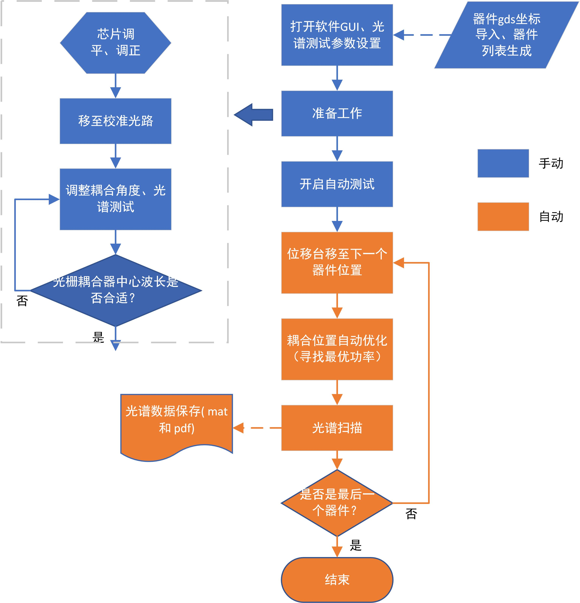
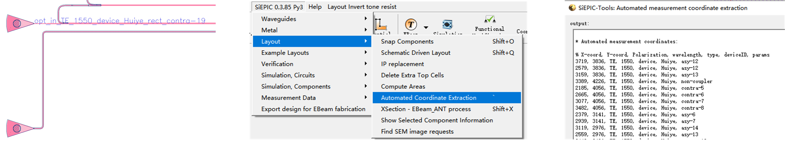
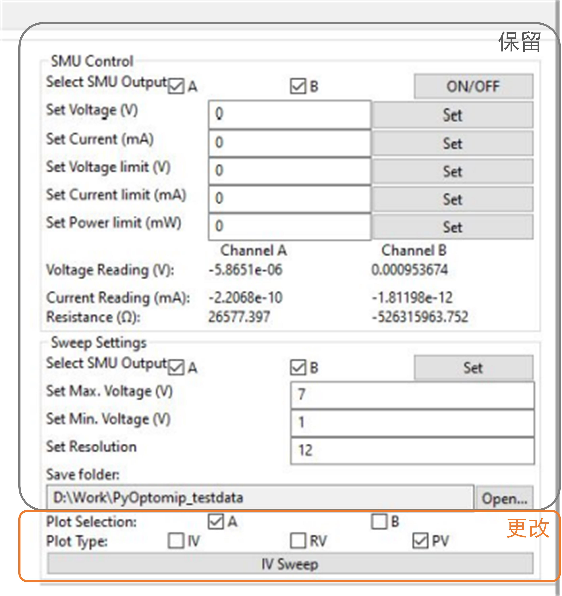

[TOC]

# 硅光芯片自动测试平台搭建

## 背景

目前实验室流片中大多数所设计的是无源器件。由于这些器件常常具有较多的结构参数变量，因此数量常常较多，手动测试非常的耗时。

本项目希望搭建一个可实现自动测试硅光芯片上的无源器件的系统和软件。由于对于无源器件，通常只需要测试其光谱响应，这为实现程序化的器件自动测试提供了方便。

此项目放在GitHub上的目的是为了程序更新、共享最新的程序、进度和经验、共同编辑一些文件。

UBC所使用的硅光芯片自动测试的软件已被发布在[pyOptomip](https://github.com/SiEPIC/SiEPIClab/releases/tag/v0.1.0)。由于所使用的位移台、激光器、功率计不一样，该软件无法直接用于我们的测试平台，但其仍然可以作为一个重要的参考。

（该文档将根据进展情况更新）

## 基本思路

目前初步构想的自动测试的基本流程如下图所示。

- 器件gds坐标导入：Klayout中，我们可以在光路的入口光栅耦合器处，放置具有一定格式的光路描述信息（Text图层），如下图的最左图所示。之后可使用[SiEPIC Tools](https://github.com/SiEPIC/SiEPIC-Tools)中的坐标导出功能，将版图中所有的具有该格式的Text图层的描述信息以及相应的坐标导出，成txt文件，如下图最右图所示。如此，便可实现版图上所有器件坐标及相应的器件描述信息的导出。可被识别的描述信息的格式为 ：opt_in_polarization_lambda_device_description

  

- 器件列表生成：将上述导出的包含器件坐标和描述的txt文件，导入到所搭建的自动测试GUI中，其将生成器件列表。
- 芯片调平：调节使得芯片与光学平台平行。否则，在自动测试过程中，光纤阵列与芯片的距离将会变化，可能会导致其碰或挤压至芯片，进而损坏光纤。
- 芯片调正：芯片的长宽边缘分别于位移台的xy位移方向平行。这是位移台能够根据gds坐标，准确移动到芯片上器件的前提。
- 耦合位置自动优化：控制电动位移台在某个范围内移动，直至找到最佳耦合功率的位置。其可通过优化算法来快速实现。

#### 使用设备

目前合肥工业大学硅光实验室使用以下主要设备用于硅光器件测试：

- 电动位移平台：KYC06020-G，骏河
- 电动位移平台控制器：DS102MS，骏河
- 激光器主机：8163B，是德
- 激光模块（嵌在激光器主机中）：81060A，是德
- 光功率计（8端口）：N7745A，是德
- 电压源：E36312A（是德）、DP932A（普源）

所涉及的相关设备的使用手册/编程手册已经全部放置在 instrument_mannuals 文件夹内。

## 项目推进方案

整体的软件，建议直接在[pyOptomip](https://github.com/SiEPIC/SiEPIClab/releases/tag/v0.1.0)的基础上些许变动，以用于我们的实验平台。这是我认为最快捷、最容易的一个方向：

- pyOptomip由前人编写，是比较成熟的程序。整体的测试系统已经经过验证。
- pyOptomip软件支持大部分我们目前使用的仪器（包括8163b主机+插槽式激光器、N7745功率计）。我们仅需要编写我们自己的位移台的函数库，并用于pyOptomip之中，即可。

### 所需学习的材料

#### Python

需要熟悉Python一些基本知识。

#### pyOptomip

整体的软件的实现，将直接参照[pyOptomip](https://github.com/SiEPIC/SiEPIClab/releases/tag/v0.1.0)，将在其基础上少许变动，以用于我们的实验平台。因此我们需要学习pyOptomip，明白它的具体工作原理和流程。

我创建了一个pyOptomip的学习笔记，见本目录下："\Learning_material\SiEPIClab\SiEPIClab 代码学习笔记.md"

pyOptomip是基于python2编写，我们需要对我们的Anaconda，做一些简单配置，使得其编译环境兼容pyOptomip，具体，见本目录下："\Learning_material\Anaconda_setups_for_SiEPIClab.md"

#### SCPI命令

仪器的SCPI命令。参照仪器的用户手册即可。

#### VISA和PyVisa

pyOptomip中，计算机与一些仪器的通讯接口为VISA（如位移台而电压源）。可将VISA理解为通讯媒介，通过它，向仪器发送SCPI命令或GPIB命令，进而对其控制。在python环境中，使用VISA是通过[PyVISA](https://pyvisa.readthedocs.io/en/latest/)来实现。需要学习PyVISA一些基本的使用方法和命令。**不用学的很深入，只需理解其大致目的，和常用命令即可**。遇到需要的，再进一步学习。相关材料：

- 网上查阅相关命令
- Keysight提供的VISA使用手册，位于本目录下："\Learning_material\Relevant_programing_manuals\AgilentVISAUserGuide.pdf"
- [NI-VISA](https://www.ni.com/zh-cn/support/documentation/supplemental/06/ni-visa-overview.html) 和 [NI-VISA Help](https://www.ni.com/docs/zh-CN/bundle/ni-visa/page/ni-visa/help_file_title.html) 也提供了很有用的VISA用户手册（NI和Keysight所使用的VISA标准，基本一致）。

#### VXIplug & play Instrument Driver

pyOptomip中，计算机与Keysight 816x主机和N77xx功率计的通讯接口为 VXIplug & play Instrument Driver。需要熟悉其相关命令和函数。可参照Keysight提供的help文件。此文件也被下载并存放于本目录："\Learning_material\Relevant_programing_manuals\Hp816x.chm"

#### wxPython 

即wx模块，用来创建软件的GUI。一个非常好的学习网站：[wxPython tutorial](https://zetcode.com/wxpython/)。我想，暂时学习下面黑色框部分即可。

### 推进建议

下面，根据**时间前后顺序**，给出个人的项目推进建议。

**总体地，建议首先编写位移台的函数库，并将其加入到软件代码中。之后尝试运行软件，并根据运行错误或问题，逐步修改其它代码，直至软件可正常运行。**

#### 仪器连接

##### 仪器初步连接和基本SCPI命令交互型测试

尝试将计算机与仪器连接，之后向其发送一些基本的SCPI或GPIB命令，看其是否有响应。

连接方式可尝试网口（Lan）、USB、GPIB、串口（serial port）。

仪器连接，以下可能有帮助：

- [Command Expert Downloads](https://www.keysight.com/us/en/lib/software-detail/computer-software/command-expert-downloads-2151326.html)  。该软件适用于Keysight的仪器（hp816x激光器主机和N77xx功率计）。应该已经被下载到实验室的电脑中。

- 学习和下载[NI-MAX](https://www.ni.com/zh-cn/support/downloads/drivers/download.system-configuration.html#371210)。NI专业做仪器自动化的，其软件和一些向导，对我们项目初始的仪器连接，会很有帮助。NI-MAX的仪器连接向导，见[NI-VISA概述](https://www.ni.com/zh-cn/support/documentation/supplemental/06/ni-visa-overview.html)（找到下图部分）

  

##### 在Python环境中，实现仪器连接和基本SCPI命令测试

对于位移台，利用PyVisa，在Python中实现仪器的连接。之后，在Python中，利用VISA基于语句，向仪器发送SCPI命令，看其是否有响应。

**后期，**若需要的话，对于Keysight的仪器（hp816x激光器主机和N77xx功率计），在Python中，利用VXIplug & play Instrument Driver，实现仪器的连接和基本命令的发送（**可在后期进行，不用在此阶段进行**）。

#### 骏河位移台控制器的代码编写

编写骏河位移台控制器（DS102）的Python代码编写。我的理解，需要编写以下几个代码：

- 代表DS102的类（Class）。可参照CorvusEco.py编写。其包含我们位移台的函数和功能。函数名建议与CorvusEco.py的一致。这样其他代码调用位移台对象时，只需更换位移台对象的名称，而不需要修改位移台函数的名称。
- DS102的连接面板，放置于软件起始连接面板GUI上。可参照CorvusEcoParameters.py编写。

之后，检查其它代码，看有无明显需要相应修改的地方。以下仅为2个例子：

- 代码中， from xxx import xxxx。需要将新编写的位移台的类导入。
- pyOptomip.pyw中，line39：需要将DS102Parameters增加至devTypes变量中。

#### 根据软件运行的错误提示，逐步修改其它代码

DS102的类以及相关连接面板编好后，修改其它地方的代码，之后尝试运行软件，即运行pyOptomip.pyw

此时，大概率软件会报错，或有各种问题阻止软件正常运行。原因是：

- 我们用了新的位移台，其它调用位移台的相关代码，可能也需要相应的更改
- 另外，尽管pyOptomip理论上，也支持我们使用的激光器主机（8163b）和光功率计（N7745），但目前还未被验证过（之前被验证的是8164b+N7744）。因此，很大可能其用在我们的配置上，有些相关代码还需要稍作更改

根据软件运行时提示的错误，逐步修改软件代码，直至软件可正常运行。

#### 电压-光谱扫描功能（新增于2023-03-12）

上述自动硅光测试软件完成后，需要在其基础上，进一步开发电压-光谱扫描功能。将使用具有三通道的Keysight 电压源， 型号为E36312A。该部分由张申昊完成，郑焱烽和冯佳旺协助。

##### 目标功能

###### 预期功能 1 （Optical Spectrum vs Voltage）

电压扫描，且每扫描一处电压，测试一次器件的光谱。可设置电压扫描范围，以及扫描步长。

如电压范围0-5 V，步长 1V 时，则一共将扫描6个数值的电压，并得到6组器件光谱数据，分别对应着该器件在6个不同电压时的光谱。具有光谱数据保存功能。该功能是为了快速得到器件的光谱随着施加电压大小的变化情况。

###### 预期功能 2（Optical Intensity vs Voltage）

波长设置为固定值。之后电压扫描，且每扫描一处电压，测试一次器件在该处波长的功率。最终可得到在该固定波长下，光功率随着电压的变化曲线。同样的，可设置电压扫描范围，以及扫描步长。该功能相对于前一个功能，相对简单很多。

##### 代码大致分类

和该功能有关的代码可考虑分为可分为以下4个

###### 电压源连接面板代码（命名建议：e3000Parameters.py）

用于创建位于起始仪器连接面板中，电压源连接面板的代码；类比代码文件：具有 xxxxxParameters.py 命名规则的代码文件。

###### 电压源基础函数库代码（命名建议：e3000_inst.py）

包含了所需要的电压源的控制函数的函数库代码；类比代码文件：CorvusEco.py、hp816x_instr.py、MGMotor_inst.py等。

###### 电压源控制面板代码（命名建议：e3000Panel.py）

用于创建位于主体控制面板中，控制电压源参数、电压-光谱扫描等功能的控制面板的代码；另外，其可以显示实时的电压源的输出电压、电流和对应的电阻大小。类比代码文件：laserPanel.py、MGMotorPanel.py等

###### 测试功能代码（命名建议：e3000_electric_sweep.py）

包含电压-光谱扫描功能、电压-光功率扫描功能的函数代码。

##### 具体代码建议

SiEPIClab的最新开发版本，已经将电压源的相关功能包括在内，具体地，其使用的是SMU（源测量单位）作为双通道电压源。因此，以下一些代码的编写，可以参考该版本中SMU相关的代码文件。

###### e3000Parameters.py

电压源连接面板。相对简单，可模仿之前的代码编写。连接方式：建议用网口（Lan）方式连接电压源。参考代码文件：[SMUParameters.py](https://github.com/SiEPIC/SiEPIClab/blob/master/pyOptomip/SMUParameters.py)

###### e3000_inst.py

这是电压源基础函数库代码。参考代码文件：[SMU.py](https://github.com/SiEPIC/SiEPIClab/blob/master/pyOptomip/SMU.py)。

可以考虑包含以下基本的函数：

- 连接相关的函数
- 电压、电流的设置函数
- 电压、电流、功率的最大值设置函数（防止不小心输入错误，电压过大导致器件烧毁）
- 电压、电流、功率的获取函数（getxxxx）
- 每个通道的开关函数

除上述函数之外，其它函数，可之后根据需要再添加。

###### e3000Panel.py

这是位于主体控制面板上，用于控制电压-光谱测试的面板。参考代码文件：[SMUFrame.py](https://github.com/SiEPIC/SiEPIClab/blob/master/pyOptomip/SMUFrame.py)

目前的控制面板空间已经不够，因此，需要其他解决办法。方法之一：考虑在该面板上，增加一个额外的Electical Tap，见[wxPython 选项卡](http://tastones.com/tutorial/wxpython/wxpython-tabs/)。

该Tap只需要容纳的电压源的控制面板及参数即可。大致如下图所示：

上图仅为示意图，来自SiEPIClab最新开发版本的截图。我们所需要的面板，相对于上述面板，大部分模块和功能可以保留，包括

- 电压、电流控制部分可保留
- 电压、电流实时读取部分可保留
- 电阻实时读取部分可保留（若可实现的话）
- 电压扫描设置部分可保留
- Plot Selection 保留（我的理解是选择发出扫描电压的电压源通道号）
- 保存文件夹，即扫描数据的保存路径，可保留。

上述面板所需要更改的地方应在于：

- Plot Type：应该分为两种，对应着本文章开头的功能1，即 Optical Spectrum vs V；另一种则对应着功能2，即 Optical Intensity vs V （即固定波长下，光功率随着电压的变化曲线）；
- 按钮 IV Sweep：这里应该换成 Sweep，具体是哪种扫描，则根据所选中的Plot Type 决定
- 额外的选择功率计端口的选项：其代表着在运行上述扫描时，记录光谱或光功率的具体的功率计端口。

###### e3000_electric_sweep.py

该代码应包含具体的上述两种扫描类型的函数：即 Optical Spectrum vs V  和 Optical Intensity vs V。

**Optical Spectrum vs V** 

点击扫描后，若是  Optical Spectrum vs V 类型的功能，则之后将扫描电压，且每描到一处电压后，进行波长扫描，得到此时电压下的器件光谱，并该光谱应画在控制面板的左图上，之后保存光谱数据。之后，所有不同电压下的多组光谱图，应画在一起（方便观察光谱的变化）。

所预想的大致的代码结构：

1. 设置电压源的电压
2. 调用`self.laser.sweep()`，实现光谱扫描
3. 画出光谱结果（参考 laserPanel.py 中的 `OnButton_Sweep` 函数）
4. 保存光谱数据，光谱图像保存为PDF格式，光谱数据保存为 .mat 格式（参考 autoMeasure.py 中的 `beginMeasure` 函数）
5. 之后重复步骤1-4，直到所有的电压，循环完毕

**Optical Intensity vs V**

点击扫描后，若是  Optical Intensity vs V 类型的功能，则之后将扫描电压，且每描到一处电压后，向功率计询问此时的功率大小。最终将Optical Intensity vs V 的数据，保存为csv格式。

所预想的大致的代码结构：

1. 设置电压源的电压
2. 调用`self.laser.readPWM(detSlot, detChan)`，向功率计询问此时的光功率。
3. 之后重复步骤1-2，直到所有的电压，循环完毕
4. 画出 光功率 vs 电压 的曲线。保存 光功率 vs 电压的数据，为csv格式。

## 分工（建议）：

（如果大家有更好、更高效的分工方案，请及时与我沟通。）

- 位移台控制器（ds102）的函数库： 冯佳旺
- ds102与计算机的连接以及连接面板GUI：郑焱烽
- 总体软件代码的修改：
  - 与位移台更加相关的部分：冯佳旺
  - 与激光器和功率计更加相关的部分：郑焱烽
- 电压-光谱扫描功能：张申昊，郑焱烽和冯佳旺协助

## 项目安排及进展

### 2023年2月-3月上旬

对应返校后的前一个月。请大家对应自己负责的部分：

- [x] 尝试通过VISA或Keysight Driver，在python环境中，通过串口、Lan、USB、GPIB等方式取得与仪器的连接。
- [x] 验证基本的SCPI命令。
- [x] python中编写并验证一些基本的仪器控制程序。
- [x] 编写ds102的函数库、连接面板。
- [x] 将ds102的相关的代码及其功能，融入到整体的软件中。并不断修复各种可能的报错，直到整体软件大致可基本运行。
- [ ] 验证完整的自动测试功能

### 2023年3月上旬-3月底

- [ ] 进一步验证 Fine Align 功能；若总是无法找到最优的耦合位置，找到、排除原因，并解决问题
- [ ] 开发电压源的连接面板、基础函数库、控制面板
- [ ] 开发电压源的扫描函数库
- [ ] 完成电压源-光谱扫描功能的开发

## 待确定问题

### 未解决

1 为什么Fine Align 功能目前无法找到最优的耦合位置（2023-03-13）

### 已解决

1.（程锐）从工作流程，可以看到，需要使用某总控制平台，去控制、协调不同设备的工作。可否通过 python 或 labview 去实现该目的？

- （2023-2-2，程锐答）：与骏河位移台之间的通讯接口，可以通过 [**pyvisa**](https://pyvisa.readthedocs.io/en/latest/) 来实现。与Keysight激光器主机和N7745多端口功率计之间的通讯接口，可以用Keysight提供的VXIplug & play Instrument Driver实现。整体仪器之间的协调，通过python语言编写程序。

- （2023-1-18，程锐答）：可能的方式，是通过Python中的 第三方库  [**pyvisa**](https://pyvisa.readthedocs.io/en/latest/) 来实现对仪器的控制，其是基于VISA（虚拟仪器软件

  构）内核的python第三方库，具有较好的可读性。初步看了一下，[pyOptomip](https://github.com/SiEPIC/SiEPIClab/releases/tag/v0.1.0)也是基于pyvisa所搭建。

  pyvisa 可对每一个仪器，创建一个对象，之后，可通过该对象，调用该仪器的SCPI（Standard Commands for Programmable Instruments）命令。每个仪器的SCPI命令，都可以从其编程手册中找到。案例之一，可从本文件夹中的"\learning_codes\ds102移动控制程序实例.py"中找到。

  除了Python，Matlab也提供 相似的VISA库，见 https://ww2.mathworks.cn/help/instrument/visa-overview.html

2.（程锐）不同设备之间，通过何种方式进行相互通讯？（GPIB，USB？）

（2023-1-18，程锐答）部分上述回答包含该问题的解决方案。

