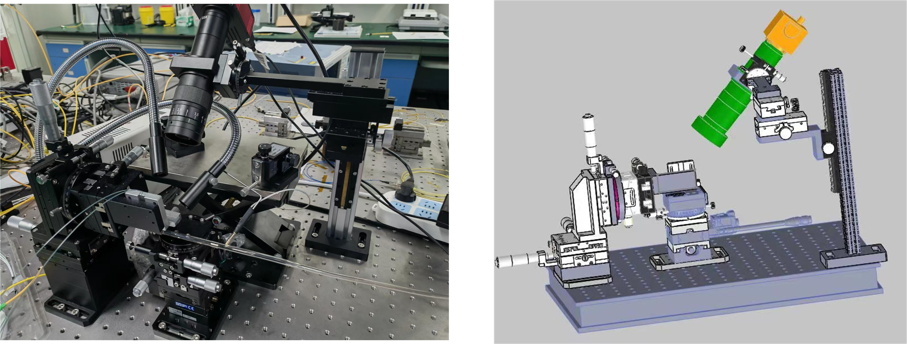

# 硅光芯片自动测试平台

本项目将**UBC Michael Caverley 等人创建的**[pyOptomip](https://github.com/SiEPIC/SiEPIClab/releases/tag/v0.1.0) 硅光芯片自动测试平台软件进行了扩展，使其进一步支持骏河DS102位移台控制器，进而适用于我们实验室的测试平台。

该软件可实现上百个硅光器件的自动无源光谱测试。这大大的节省了测试的时间。

源代码位于本仓库的[pyOptomip_modifed](https://github.com/SiP-HFUT/Sip-automatic_probe_station/tree/main/pyOptomip_modifed)文件夹之中。由郑焱烽（dingchunfjw@163.com）和冯佳旺（1335959606@qq.com）完成。一些用户手册包含在本目录下的pyOptomip_modifed_manuals文件夹中。

**基本实现思路：**

- 使用垂直光纤阵列进行耦合，测试过程中光纤阵列位置固定
- 通过电动位移台实现芯片位移的精确控制，从而实现芯片上所有器件的寻找、自动耦合、测试。

目前所用的测试硬件包括：

- Keysight 光谱测试系统：8163B主机+81960A激光器+N7745A功率计；理论上，该代码也支持Keysight 8164B主机和相关系列的激光模块（如81940A激光模块）和模块式的功率计（如81630B）
- 芯片承载台（下列顺序由下到上）
  - 骏河电动位移台 KYC06020-G （由骏河DS102控制，可沿xy方向移动），位于最底部，用于精确的控制芯片的位移
  - 两个上下堆叠在一起的弧摆台，用以控制芯片的水平
  - 360度旋转台，用以控制芯片的旋转
  - 芯片台，其中具有真空吸附功能
- 卤素灯Y分支型冷光源
- 六维精密位移调节架，其用来控制光纤阵列（测试前用来调节光纤阵列角度、高度等；但自动测试过程中，光纤阵列位置保持固定）
- 倾斜显微观察系统（一套）

下图所示：

该代码的测试流程如下图所示

